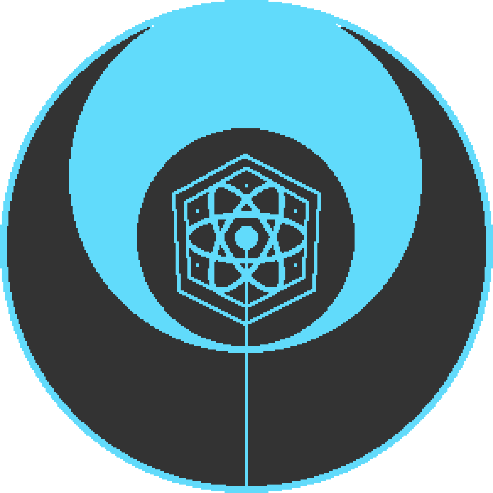

<h1 align='center'>
  
  Projet Reactor


</h1>

Welcome on the project Reactor. This is an end-of-studies project, it's a rogue-like game programmed in React and Node.


## Requirements

To test this project, some install are required:

* [Node.js](https://nodejs.org/en/)
* [MySQL](https://dev.mysql.com/doc/refman/8.0/en/installing.html)
* [Yarn](https://yarnpkg.com/en/docs/install#debian-stable)

## Dependencies

List of dependencies use by this project (click to expand):

<!-- markdownlint-disable MD013 MD033 -->
<details>
  <summary>
    <strong>Dev Dependencies</strong>
  </summary>
  <ul>
    <li>babel/core</li>
    <li>eslint</li>
    <li>webpack</li>
    <li>jsdoc</li>
  </ul>
</details>

<details>
  <summary>
    <strong>Front-End</strong>
  </summary>
  <ul>
    <li>babel/polyfill</li>
    <li>axios</li>
    <li>classnames</li>
    <li>lodash</li>
    <li>material UI</li>
    <li>matter</li>
    <li>react</li>
    <li>react-dom</li>
    <li>react-game-kit</li>
    <li>react-redux</li>
    <li>react-hot-loader</li>
    <li>react-router-dom</li>
    <li>redux</li>
    <li>redux-form</li>
    <li>shuffle-array</li>
  </ul>
</details>

<details>
  <summary>
    <strong>Back-End</strong>
  </summary>
  <ul>
    <li>bcrypt</li>
    <li>body-parser</li>
    <li>cookie-parser</li>
    <li>cors</li>
    <li>express-mysql-session</li>
    <li>express-session</li>
    <li>express-validator</li>
    <li>jwt-decode</li>
    <li>mysql</li>
    <li>nodemon</li>
    <li>passport</li>
    <li>passport-jwt</li>
    <li>passport-local</li>
  </ul>
</details>
<!-- markdownlint-enable MD013 MD033 -->

## Installation

Clone the repositery and:

Install all dependencies
```
yarn install
```

Insert Data in database

Start Node Server
```
yarn start-server
```

Start Webpack Server
```
yarn start
```

## Documentation

To read the doc: [Reactor Documentation](https://www.await.fr/reactordoc/).

The documentation was generated with [JSDOC3](https://github.com/jsdoc3/jsdoc) and [DodDash template](https://github.com/clenemt/docdash).

## Browser Support

We just support the latest version of chrome for now.

<!-- markdownlint-disable MD013 MD033 -->
| [](http://godban.github.io/browsers-support-badges/)</br>Edge | [](http://godban.github.io/browsers-support-badges/)</br>Firefox | [](http://godban.github.io/browsers-support-badges/)</br>Chrome | [](http://godban.github.io/browsers-support-badges/)</br>Safari |
| ---------- | ----------- | --------- | ---------- |
| No Support | No Suppport | Latest    | No Support |
<!-- markdownlint-enable MD013 MD033 -->

## Change Log

This project is still WIP.

## Current Project Team

- Fabien C.
- Pierro Imhoff
- Raphaël Picard
- Luna O. V.

## License

MIT